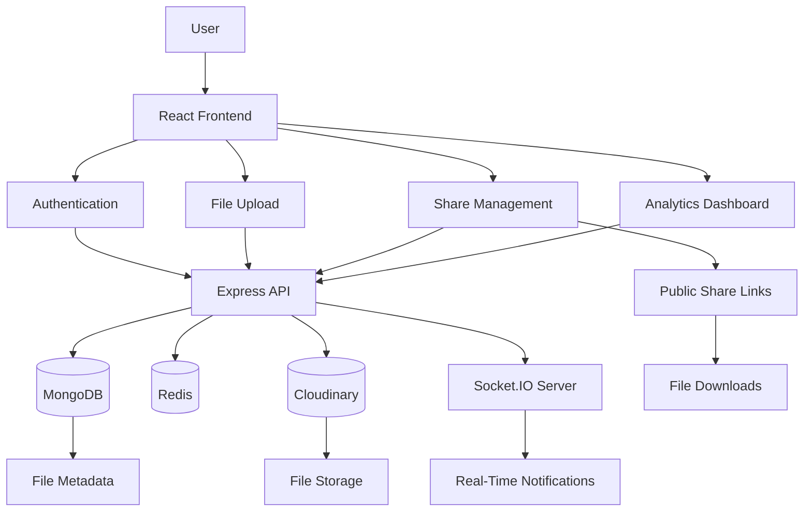

<p align="center">
  
</p>

# 📁 File Sharing System

A full-stack file sharing platform that enables users to upload, manage, share, and track files securely. Built with modern web technologies and designed for scalability, security, and a smooth user experience.

---

## 🛠️ Tech Stack

<p align="center">
  
  
  
  
  
  
  
  
</p>

---

## ✨ Features

### 📤 File Management
- Chunked and resumable uploads
- File versioning support
- Favorites and custom tags
- Bulk file operations
- Password-protected files

### 🔗 Sharing System
- Secure share links
- Expiration controls
- Download limits
- Bandwidth quotas
- Public share pages

### 🔔 Notifications
- Real-time notifications using Socket.IO
- Email notifications
- Expiry reminders
- Notification center

### 📊 Analytics
- File view and download tracking
- Trending files
- Engagement metrics
- File type statistics

### 🔒 Security
- JWT authentication
- Password hashing with bcrypt
- Rate limiting
- Input validation
- CORS protection

---

## 📂 Project Structure

```text
File-Sharing-System/
├── client/                         # React + Vite frontend application
│   ├── src/
│   │   ├── components/             # Reusable UI components
│   │   │   ├── Authentication/     # Login, Register, User Authentication
│   │   │   ├── Home/               # Dashboard, File Manager, Analytics
│   │   │   └── Share/              # Public sharing and download pages
│   │   ├── services/               # API services and business logic
│   │   ├── utils/                  # Helper functions and utilities
│   │   └── App.tsx                 # Main application component
│   ├── package.json
│   └── vite.config.ts
│
├── server/                         # Express.js backend API
│   ├── config/                     # Database, Redis, Cloudinary configs
│   ├── controllers/                # Request handlers and business logic
│   ├── middleware/                 # Authentication and validation middleware
│   ├── models/                     # MongoDB/Mongoose schemas
│   ├── routes/                     # API route definitions
│   ├── jobs/                       # Scheduled background jobs
│   ├── utils/                      # Helper utilities and services
│   ├── tests/                      # Backend test suites
│   ├── index.js                    # Server entry point
│   └── package.json
│
├── docs/                           # Project documentation and guides
├── .github/                        # GitHub workflows and repository settings
└── README.md                       # Project overview and setup instructions

```

---

## 🔄 Application Workflow



**Overview:** Users interact with the React frontend, which communicates with the Express backend for authentication, uploads, sharing, analytics, and notifications. MongoDB stores metadata, Redis handles caching and session management, Cloudinary stores files, and Socket.IO delivers real-time updates.

---
## 🚀 Quick Start

### Prerequisites

- Node.js 20+
- MongoDB
- Redis (optional)
- Cloudinary Account

### 1. Clone the Repository

```bash
git clone https://github.com/<yourusername>/File-Sharing-System.git
cd File-Sharing-System
```

### 2. Setup the Backend

```bash
cd server
npm install
cp .env.example .env
```

Configure your environment variables in `.env`.

Start the server:

```bash
npm run dev
```

Backend runs on:

```text
http://localhost:5000
```

### 3. Setup the Frontend

```bash
cd ../client
npm install
npm run dev
```

Frontend runs on:

```text
http://localhost:5173
```

---


## 🧪 Testing

### Backend

```bash
cd server
npm test
```

### Frontend

```bash
cd client
npm test
```

---

## 🌐 Deployment

### Frontend

```text
Vercel
```

### Production Build

```bash
cd client
npm run build
```

---

## 🤝 Contributing
```
```
Contributions are welcome.

Before contributing, please review:

Contributing Guidelines and Code of Conduct for more details.

This project is proud to be part of the Social Summer of Code 2026 (SSOC '26)! We highly encourage contributions to improve the system's features, accessibility, and security.


### Contribution Workflow

```bash
# Fork the repository

# Clone your fork
git clone <your-fork-url>

# Create a branch
git checkout -b feature/your-feature

# Make changes

# Commit changes
git commit -m "feat: add new feature"

# Push changes
git push origin feature/your-feature
```

Open a Pull Request once your changes are ready.

---


## 👨‍💻 Author

**Anchal Singh**  
Full Stack Developer

- GitHub: https://github.com/imanchalsingh

---

<p align="center">
  Made with ❤️ by contributors
</p>
